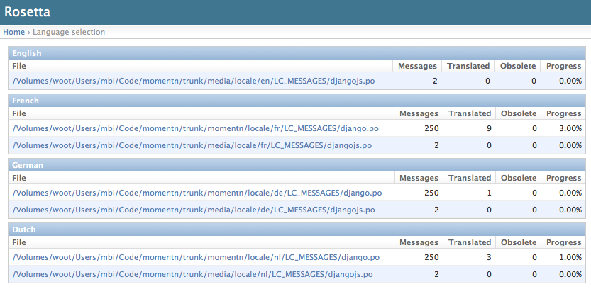
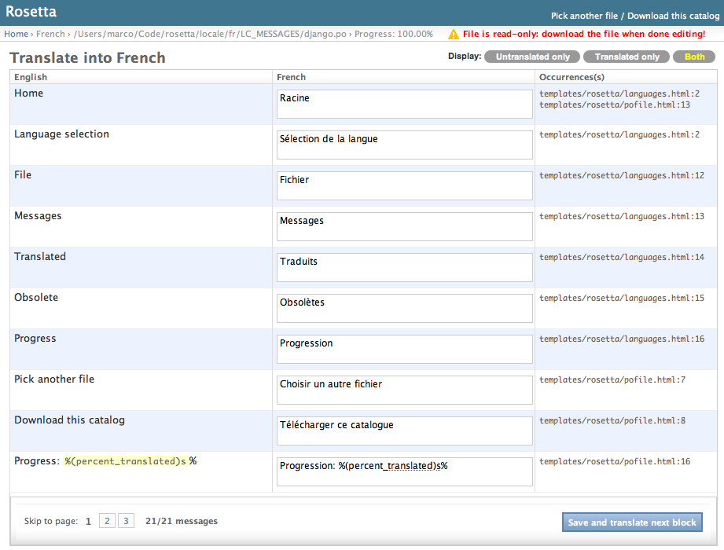

Usage
=====

Generate a batch of files to translate
--------------------------------------

See `Django's documentation on Internationalization <https://docs.djangoproject.com/en/stable/topics/i18n/translation/>`_ to set up your project to use i18n and create the ``gettext`` catalog files.

Translate away!
---------------

Start your Django development server and point your browser to the URL prefix you have chosen during the installation process. You will get to the file selection window.

Select a file and translate each untranslated message. Whenever a new batch of messages is processed, Rosetta updates the corresponding `django.po` file and regenerates the corresponding ``mo`` file.

This means your project's labels will be translated right away, unfortunately you'll still have to restart the web server for the changes to take effect. (NEW: if your web server supports it, you can force auto-reloading of the translated catalog whenever a change was saved. See the note regarding the ``ROSETTA_WSGI_AUTO_RELOAD`` variable in ``conf/settings.py``.

If the webserver doesn't have write access on the catalog files (as shown in the screen shot below) an archive of the catalog files can be downloaded.

Translating Rosetta itself
--------------------------

By default Rosetta hides its own catalog files in the file selection interface (shown above.) If you would like to translate Rosetta to your own language:

1. Create a subdirectory for your locale inside Rosetta's ``locale`` directory, e.g. ``rosetta/locale/XX/LC_MESSAGES``
2. Instruct Django to create the initial catalog, by running ``django-admin.py  makemessages -l XX`` inside Rosetta's directory (refer to `Django's documentation on i18n <http://www.djangoproject.com/documentation/i18n/>`_ for details)
3. Instruct Rosetta to look for its own catalogs, by appending `?rosetta` to the language selection page's URL, e.g. ``http://127.0.0.1:8000/rosetta/pick/?rosetta``
4. Translate as usual
5. Send a pull request if you feel like sharing

Acknowledgments
***************

* Rosetta uses the excellent `polib <https://bitbucket.org/izi/polib>`_ library to parse and handle gettext files.
